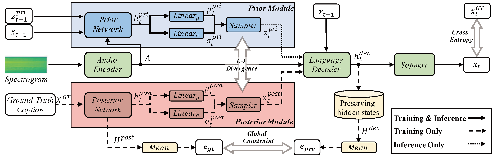

# Generating Accurate and Diverse Audio Captions through Variational Autoencoder Framework
This is the official code implementation of the paper “**Generating Accurate and Diverse Audio Captions through Variational Autoencoder Framework**”. The pipeline of the method is shown below
<p align="center">
  
</p>
<p align="center">The architecture of our proposed AC-VAE.</p>

## Abstract
Generating both diverse and accurate descriptions is an essential goal in the audio captioning task. Traditional methods mainly focus on improving the accuracy of the generated captions but ignore their diversity. In contrast, recent methods have considered generating diverse captions for a given audio clip, but with the potential trade-off of compromising caption accuracy. 
In this work, we propose a new diverse audio captioning method based on a variational autoencoder structure, dubbed AC-VAE, aiming to achieve a better trade-off between the diversity and accuracy of the generated captions.
To improve diversity, AC-VAE learns the latent word distribution at each location based on contextual information. To uphold accuracy, AC-VAE incorporates an autoregressive prior module and a global constraint module, which enable precise modeling of word distribution and encourage semantic consistency of captions at the sentence level. We evaluate the proposed AC-VAE on the Clotho dataset. Experimental results show that AC-VAE achieves a better trade-off between diversity and accuracy compared to the state-of-the-art methods.

## Data Preprocessing and Experimental Configuration

We are very grateful for the support provided by Xuenan, the specific data preprocessing and experimental environment configuration are similar to the code (https://github.com/wsntxxn/AudioCaption).

## Start training
```python
 python runners/pytorch_runner_vae.py train config/AC-VAE.yaml
```

！！！As soon as the paper is accepted, we will disclose the model weights ！！！